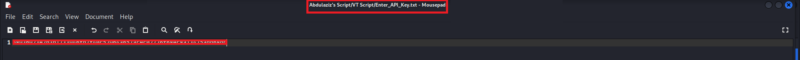
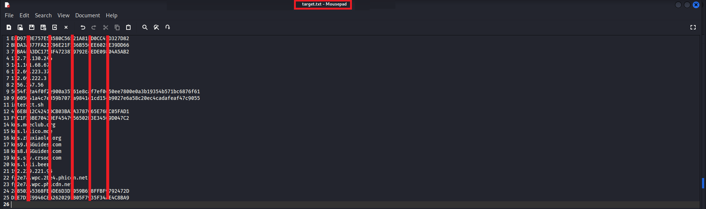
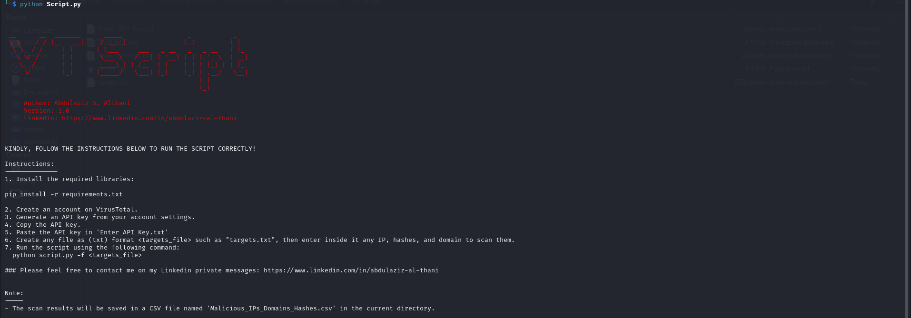
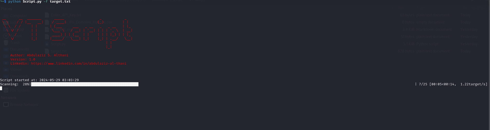
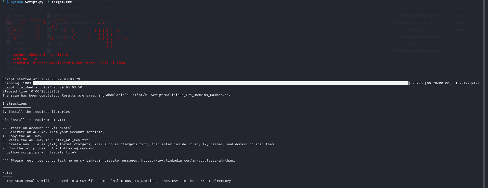
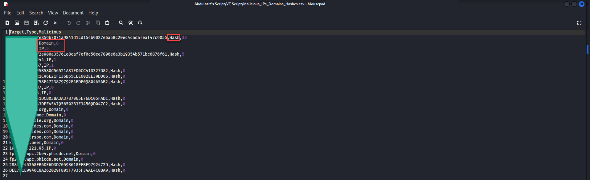

# VT Script
### Reach me at:

     Author: Abdulaziz S. Althani
     Version: 1.0
     Linkedin: https://www.linkedin.com/in/abdulaziz-al-thani

                                                                           
### Description
VT-Script is a powerful and user-friendly tool designed to simplify the process of scanning IP addresses, domains, and file hashes for potential malicious activities. Leveraging the VirusTotal API, this script provides a comprehensive solution for security professionals, incident responders, and cybersecurity enthusiasts.

### Key Features
- Target Scanning: The script can scan a wide range of targets, including IP addresses, domains, and file hashes, for potential malicious activities. It supports reading targets from a user-specified file, making it a versatile and efficient tool.
- VirusTotal API Integration: VT-Script integrates seamlessly with the VirusTotal API, allowing users to fetch detailed information about the provided targets. This integration requires a valid VirusTotal API key, which can be stored securely in a .env file.
- CSV Output: The script generates a CSV file named "Malicious_IPs_Domains_Hashes.csv" in the current directory, containing the scanned targets, their types, and their maliciousness scores. This output can be easily analyzed and shared with relevant stakeholders.
- Progress Tracking: VT-Script utilizes a progress bar to keep users informed about the scanning progress for each target, ensuring a smooth and transparent user experience.
- Error Handling: The script is designed to handle errors that may occur during the scanning process, providing appropriate error messages to help users troubleshoot any issues.
- Detailed Instructions: VT-Script includes a banner and comprehensive instructions on how to use the tool and set up the required environment, making it accessible to users of all skill levels.

### Use Cases
VT-Script is a versatile tool that can be utilized in a variety of cybersecurity and incident response scenarios, including:

- Threat Intelligence: Scanning IP addresses, domains, and file hashes to identify potential threats and integrate the findings into threat intelligence efforts.
- Incident Response: Analyzing indicators of compromise (IoCs) during incident response investigations to determine the scope and impact of a security breach.
- Network Security: Monitoring and analyzing network traffic by scanning IP addresses and domains for signs of malicious activity.
- Malware Analysis: Examining file hashes to assess the maliciousness of downloaded or suspicious files.


### Requirements:
1. **Python**: The script is written in Python, so you will need to have Python installed on your system. The script was developed using Python 3.9, but it should work with other versions of Python 3 as well.
2. **Required Python Packages**:
   - `requests`: Used for making HTTP requests to the VirusTotal API.
   - `csv`: Used for writing the scan results to a CSV file.
   - `dotenv`: Used for loading the VirusTotal API key from a `.env` file.
   - `argparse`: Used for parsing command-line arguments.
   - `datetime`: Used for recording the start and end times of the script.
   - `tqdm`: Used for displaying a progress bar during the scanning process.
   
You can install the required packages using the following command:
```
pip install requests csv dotenv argparse datetime tqdm

```
3. **VirusTotal API Key**: The script requires a valid VirusTotal API key to access the VirusTotal API. You need to create an account on the VirusTotal website and generate an API key. Once you have the API key, store it in a "nter_API_Key.txt" file in the same directory as the script as is it.
4. **Targets File**: The script expects a file containing the targets (IP addresses, domains, or file hashes) that you want to scan. Each target should be on a new line in the file.
5. **Operating System**: The script should work on any operating system that can run Python, such as Windows, macOS, or Linux.

Make sure you have all the requirements in place before running the Virustotal_checker script. If you encounter any issues, refer to the instructions provided in the script's banner or the `print_instructions()` function.
### Usage:
1. Install the required libraries:
```
pip install -r requirements.txt

```
2. Create an account on VirusTotal.
3. Generate an API key from your account settings.
4. Copy the API key
5. Paste the API key in 'Enter_API_Key.txt'

7. Create any file as (txt) format <targets_file>, then enter any IP, hashes, and domain to scan them.

9. Run the script using the following command:
  python script.py

 python script.py -f <targets_file>



### Please feel free to contact me on my Linkedin private messages: https://www.linkedin.com/in/abdulaziz-al-thani
